

  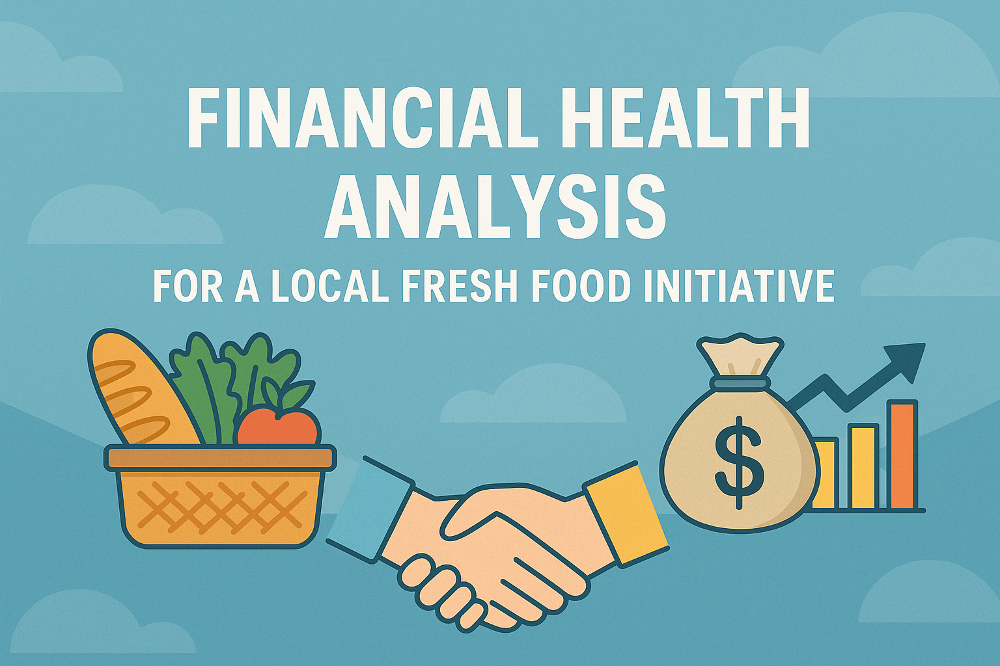

# 🥕 Financial Turnaround Strategy for PEC Fresh

*A deep-dive financial analysis of a rural nonprofit food market using five years of operations data, leading to an endorsed turnaround strategy by executive leadership.*

* Dataset timing: **2019 – 2024**
* Topics covered: **Financial Sustainability & Social Impact**
* Models used: **Comparative Year-over-Year Financial Review**
* Skills demonstrated: **Excel Analysis, Consulting Frameworks, Branch Modeling**
* Expected outcome:

  * **Cut cost burden by \~CA\$30,000**
  * **Improve operational sustainability of PEC Fresh**

---

## 🏆 Recognition

- ✔ Endorsed by **Kathy Kennedy**, Executive Director, PELC  
- ✔ Earned **Certificate in Social Impact** from Queen’s University  
- ✔ Profiled by CEISI for high-impact student work

  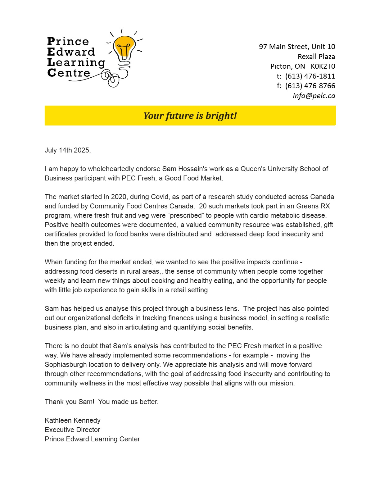 
  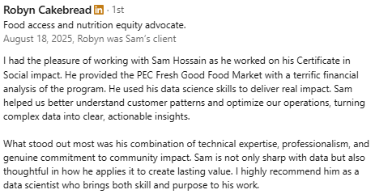

---

🔒 Data Privacy Notice

This repository does not include or expose any raw data due to confidentiality agreements. All analysis is based on proprietary financial and behavioral datasets provided by the client.

---

## 👥 Author

**Sam Hossain**

---

## 🔍 Problem Statement

  
  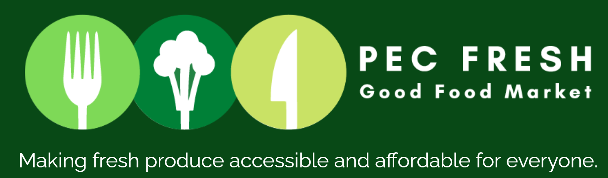

**Goal:**
Diagnose persistent net losses at PEC Fresh and recommend cost-effective solutions while maintaining community food access.

**Challenges Addressed:**

* Disproportionate wage growth vs. revenue
* Operational cost allocation across multiple branches
* Dependency on volatile donation funding
* Limited ability to scale outreach without structural redesign

---

## 🔧 Workflow

### ✅ Financial Analysis & Branch Review

* Analyzed 5 years of income statements (by branch & total)
* Categorized revenue and expenses to isolate leakage points

### 🤖 Branch-by-Branch Financial Analysis

| Branch       | Status | Net Income (2024) | Verdict                      |
| ------------ | ------ | ----------------- | ---------------------------- |
| Picton       | Active | -49,075.19        | Needs efficiency reform      |
| Sophiasburgh | Closed | -11,961.30        | Shutdown validated           |
| Consecon     | Active | -1,085.86         | Monitor for future viability |

**Financial Analysis Output:** Recommended closure of Sophiasburgh, tighter control at Picton, and cost monitoring at Consecon.

### 💼 Strategic Recommendations & Tracking

* Rolled out branch-by-branch performance matrix
* Set measurable KPIs for monthly performance tracking
* Incorporated community engagement goals into reporting

---

## 💡 Key Findings

- Sophiasburgh incurred costs despite closure → recommended shutdown  
- Wage growth outpaced sales → suggested volunteer substitution  
- Consecon shows promise but needs monitoring  
- Overall deficit of **$11,000+** could be reversed with action  

---

## 💡 Key Recommendations

| Recommendation                  | Status           |
|-------------------------------|------------------|
| Close Sophiasburgh            | ✅ Completed     |
| Cancel Square Premium         | ✅ Advised       |
| Introduce Pre-ordering Model  | 🔄 In Planning   |
| Reallocate Staff Hours        | ✅ In Progress   |
| Establish Branch KPIs         | ✅ Adopted       |

  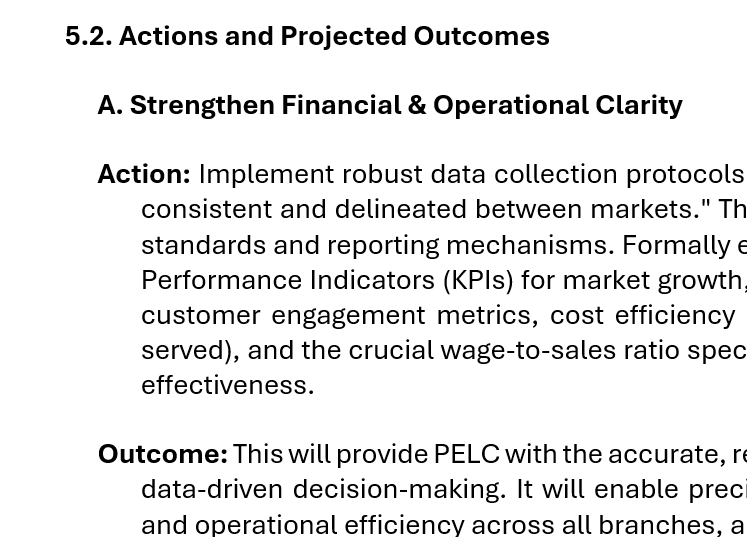

---

## 📈 Expected Business Impact

- 💵 ~$30,000 cost recovery  
- 📉 Reduced wage-to-sales ratio  
- 📊 Improved program reporting and donor confidence  
- ✅ Increased social impact with fiscal sustainability

  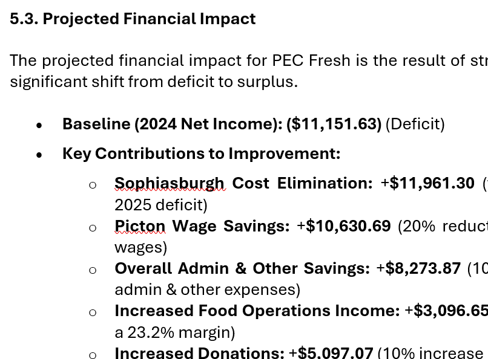

---

## 📊 Output Dashboard

  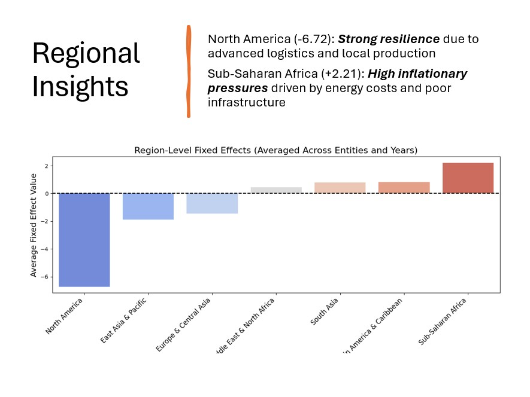
  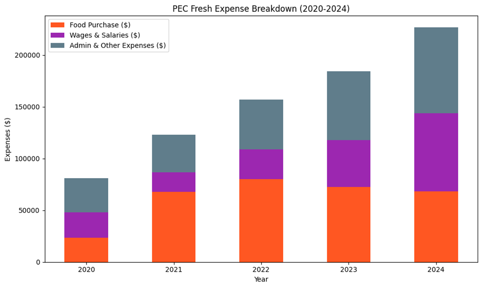
  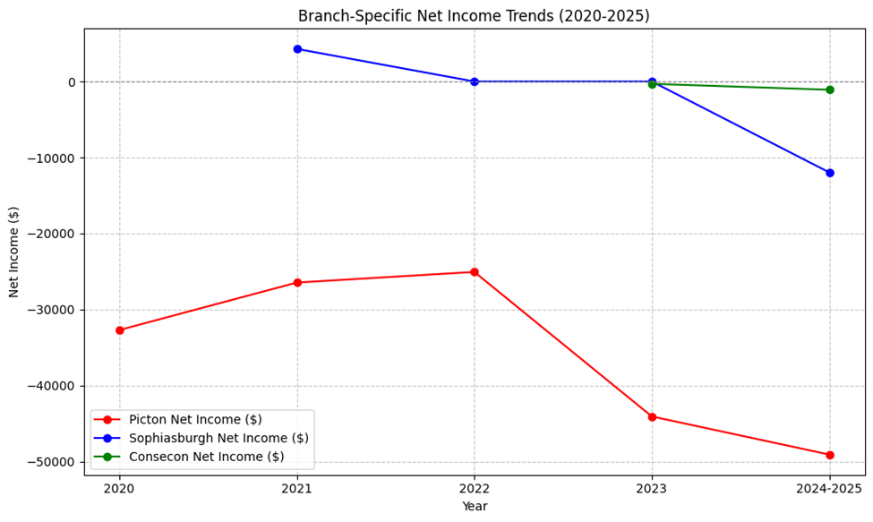
  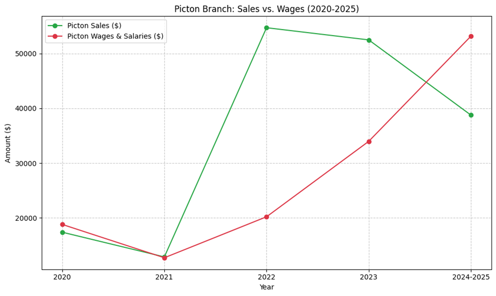
  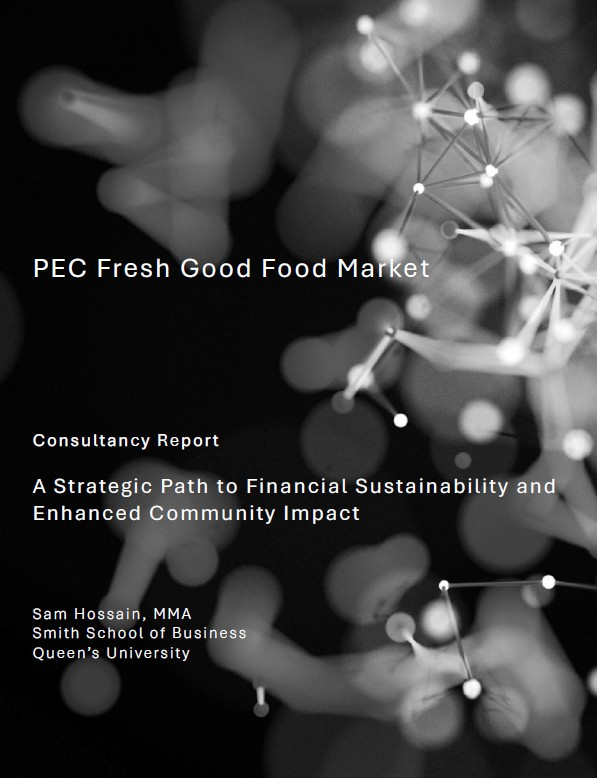
  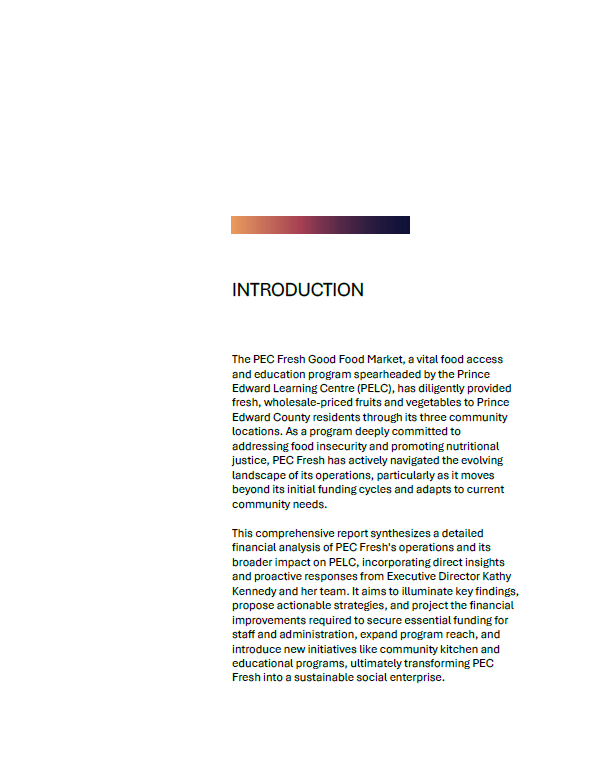

---

## 🧼 Data Sources

* Internal income statements from PELC (2019–2024)
* Stakeholder interviews and qualitative inputs from staff
* Community needs and food insecurity data from PELC reports

---

## 🔓 License

This project is licensed under the [MIT License](LICENSE).

